# Project 1 Planning: The Unofficial Guide

> Write this document before you write any pipeline code.
> Your spec and architecture diagram are what you'll use to direct AI tools (Claude, Copilot, etc.) to generate your implementation — the more specific they are, the more useful the generated code will be.
> Update the Retrieval Approach and Chunking Strategy sections if you change your approach during implementation.
> Update this file before starting any stretch features.

---

## Domain

<!-- What domain did you choose? Why is this knowledge valuable and hard to find through official channels? -->

I chose course and professor reviews for Computer Science at the University of Southern California. This knowledge is valuable to computer science students because it gives context to the difficulty of the class and professor preparation. There are times where one professor can make the class more difficult than another professor through difficult exams, lack of office hours, or simply not doing a better job at making complex topics digestible. 

This information is valuable for a student who is really interested in a class topic, wants to prepare their course plan ahead of time, or wants raw insight from previous students to be prepared for a class. It also helps with picking a major, switching majors, or choosing between very similar majors. 

The university does not provide this information. The professor does not provide insight into their teaching style, syllabus or expectations prior to the first day of class. This information is not accessible unless physically asked for to a professor, alumni, or counselor. 

---

## Documents

<!-- List your specific sources: URLs, subreddit names, forum threads, or file descriptions.
     Aim for at least 10 sources that together cover different subtopics or perspectives within your domain. -->

| # | Source | Description | URL or location |
|---|--------|-------------|-----------------|
| 1 | Rate My Professors | All USC reviews including courses, food, housing, professors, etc | https://www.ratemyprofessors.com/school/1381 |
| 2 | Rate My Professors | All professors in computer science at USC | https://www.ratemyprofessors.com/search/professors/1381?q=*&did=11 |
| 3 | Reddit | Current Student's experiences with professors at USC | https://www.reddit.com/r/USC/comments/1mfmw0w/why_are_all_the_cs_professors_at_usc_meh/ |
| 4 | Reddit | Description of Core CS Classes at USC | https://www.reddit.com/r/USC/comments/rrvjj1/small_guide_to_the_cs_core_curriculum_at_usc/ |
| 5 | Reddit | Description of Difficulty of CS Major at USC | https://www.reddit.com/r/USC/comments/8x3ar3/how_difficult_is_the_cs_major/ |
| 6 | Quora | General Overview of CS Major at USC focused on difficulty of classes | https://www.quora.com/How-is-the-Computer-Science-major-at-USC-How-hard-are-the-CS-classes-at-USC |
| 7 | usc.edu | Official Course Plan for Computer Science major | https://www.cs.usc.edu/academic-programs/undergrad/computer-science/ |
| 8 | usc.edu | Official Course Plan for Computer Science & Business Administration major | https://www.cs.usc.edu/academic-programs/undergrad/computer-science-business-administration/ |
| 9 | Reddit | Current Student debating between Computer Science or Computer Science & Business Admistration majors | https://www.reddit.com/r/USC/comments/zw1pp4/cant_decide_between_internal_transfer_to_csba_or/ |
| 10 | Reddit | Pros and Cons of Computer Science & Business Administration major | https://www.reddit.com/r/USC/comments/1mp1bf/what_are_the_pros_and_cons_of_majoring_in/ |

---

## Chunking Strategy

<!-- How will you split documents into chunks?
     State your chunk size (in tokens or characters), overlap size, and explain why those
     numbers fit the structure of your documents.
     A review-heavy corpus warrants different chunking than a long FAQ. -->

**Chunk size:** 

1200 - 1500 Characters

**Overlap:**

200 - 250 Characters

**Reasoning:**

I wanted one consistent strategy across all sources. My sources are either naturally grouped (RMP by professor) or naturally segmented (Reddit/Quora by paragraph/class/topic), so chunks tend to capture coherent units of meaning.

For RMP specifically, reviews are already grouped by professor on the page, so a chunk of 4-5 reviews is essentially "what students think of Professor X" — which is exactly what you'd want to retrieve for that query. The only edge case is the tail end of one professor's reviews bleeding into the next, but the signal ratio is still heavily weighted toward the right professor, and the LLM can use the professor's name in each review to attribute opinions correctly.

For Reddit and Quora sources, posts are already broken into paragraphs or sections by class, topic, or question. Reddit paragraphs tend to be shorter and more concise than typical, closer to 5 sentences and 550 characters, so two paragraphs still fits comfortably within the 1200–1500 character range without needing a separate strategy.

A typical paragraph I estimated at around 6 sentences and 650 characters, making two paragraphs roughly 1300 characters. The 200–250 character overlap covers 2–3 sentences, enough to avoid cutting a thought at a boundary without being so long that one class's difficulty bleeds into another's.

Known limitation:
Sources 7 and 8 (USC.edu official course pages) are structured as bulleted lists rather than paragraphs. A single chunk from these sources may contain 15–20 course requirements or course names, each a short bullet. This means the chunk's embedding points in many directions simultaneously, which can hurt retrieval precision for specific course queries. This is a known tradeoff accepted in favor of keeping one consistent chunking strategy for a first project.

---

## Retrieval Approach

<!-- Which embedding model are you using (e.g., all-MiniLM-L6-v2 via sentence-transformers)?
     How many chunks will you retrieve per query (top-k)?
     If you were deploying this for real users and cost wasn't a constraint, what tradeoffs
     would you weigh in choosing a different embedding model — context length, multilingual
     support, accuracy on domain-specific text, latency? -->

**Embedding model:**

all-MiniLM-L6-v2 via sentence-transformers

The all-MiniLM-L6-v2 has a small context window, which means the tail end of the 1200-1500 character chunks may get cut off during embedding. I'm accepting it as a tradeoff for a first project because the model is free, local, and requires no setup.

**Top-k:**

5

Class queries need more chunks than professor queries because class names appear across many sources like Reddit, Quora, RMP, and USC.edu, so you want to pull from multiple perspectives. Professor information is more concentrated, mostly on RMP, with the professor's name only appearing once at the top and reviews beneath it.
I settled on k=5 because k=10 dilutes professor queries too much. If only 3 chunks are strongly about Professor X, chunks 4 through 10 are just loosely related noise. k=5 is enough to capture meaningful context for class queries across sources, and keeps professor queries focused. I am consciously accepting that I might miss some class information at k=5, but that is a better tradeoff than returning bad or diluted information for professor queries.

**Production tradeoff reflection:**

For a production deployment the tradeoffs get more complex. General models may not understand USC specific terminology like course codes, professor nicknames, or student slang like "weedout class," so a model trained on more domain specific text would perform better. USC also has a large international student population, so multilingual support would be an important consideration. Context length matters too because the model needs to comfortably handle 1200-1500 character chunks without cutting them off and losing meaning. Latency is not ultra critical but students looking up classes during registration periods need reasonable response times.

---

## Evaluation Plan

<!-- List your 5 test questions with their expected correct answers.
     Questions should be specific enough that you can judge whether the system's response
     is right or wrong. "What are good dining halls?" is too vague.
     "What do students say about wait times at [dining hall name] during lunch?" is testable. -->

| # | Question | Expected answer |
|---|----------|-----------------|
| 1 | What are the pros and cons of choosing CSBA over CS? | Pros: CSBA still has the core computer science classes, but includes more business classes. Better for people who want a more broad and less technical major, but still cover the difficult technical classes needed for software engineering. Cons: electives aren't as technical for CSBA, complex classes like operating systems are not covered in CSBA |
| 2 | Is Redekopp is a good professor? | Yes, Redekopp is an excellent teacher and he makes the content for 103 and 104 very digestible. |
| 3 | Should I take CSCI 103 or skip to CSCI 104? | It is not recommended because CSCI 104 is a DSA class and a big step up. CSCI 103 prepares you well for it. |
| 4 | Who are the best professors for CSCI 170? | Aaron Cote is known for making content very digestible, especially complex theory. |
| 5 | What do students say about CSCI 270 difficulty? | It is one of the hardest math classes on campus. It challenges you theoretically, but if you like math, you may have a step on the other students. |

---

## Anticipated Challenges

<!-- What could go wrong? Name at least two specific risks with reasoning.
     Consider: noisy or inconsistent documents, missing source attribution, off-topic
     retrieval, chunks that split key information across boundaries. -->

1. Sources 7 and 8 (USC.edu official course pages) are structured as bulleted lists rather than paragraphs. A single chunk from these sources may contain 15–20 course requirements or course names, each a short bullet. This means the chunk's embedding points in many directions simultaneously, which can hurt retrieval precision for specific course queries. The chunk might not get retrieved at all, so the user asks about a specific CSCI requirement and the system either returns nothing relevant or pulls from a completely different source

2. With Top k at 5, we may miss some important class information because of the amount of times a specific class can show up. Student reviews on reddit, or student reviews on Rate my professor could be missed for popular classes with many reviews. 

---

## Architecture

<!-- Draw a diagram of your pipeline showing the five stages:
     Document Ingestion → Chunking → Embedding + Vector Store → Retrieval → Generation
     Label each stage with the tool or library you're using.
     You can use ASCII art, a Mermaid diagram, or embed a sketch as an image.
     You'll use this diagram as context when prompting AI tools to implement each stage. -->

```mermaid
flowchart LR
    A[Document Ingestion<br/>Python] -->|Raw Documents| B[Chunking<br/>Python]
    B -->|Text Chunks| C[Embedding + Vector Store<br/>all-MiniLM-L6-v2<br/>sentence-transformers<br/>ChromaDB]
    C -->|Embeddings| D[Retrieval<br/>ChromaDB]
    D -->|Relevant Chunks| E[Generation<br/>Groq llama-3.3-70b-versatile]
    E -->|Generated Response| F[Output]
    
    classDef ingestion stroke:#818cf8,fill:#eef2ff
    classDef chunking stroke:#a78bfa,fill:#f5f3ff
    classDef embedding stroke:#2dd4bf,fill:#f0fdfa
    classDef retrieval stroke:#38bdf8,fill:#f0f9ff
    classDef generation stroke:#fb923c,fill:#fff7ed
    classDef output stroke:#4ade80,fill:#f0fdf4
    
    class A ingestion
    class B chunking
    class C embedding
    class D retrieval
    class E generation
    class F output
```

---

## AI Tool Plan

<!-- For each part of the pipeline below, describe:
     - Which AI tool you plan to use (Claude, Copilot, ChatGPT, etc.)
     - What you'll give it as input (which sections of this planning.md, which requirements)
     - What you expect it to produce
     - How you'll verify the output matches your spec

     "I'll use AI to help me code" is not a plan.
     "I'll give Claude my Chunking Strategy section and ask it to implement chunk_text()
     with my specified chunk size and overlap" is a plan. -->

**Milestone 3 — Ingestion and chunking:**

Claude. I will provide my diagram and planning.md to produce a functions like load_sources, load_source, chunk_source. I expect it to scrape and load the sources, write code to chunk the data. I will verify this by printing out chunked data for a given source and ensuring it follows my chunking specs in planning.md. 

**Milestone 4 — Embedding and retrieval:**

Claude. I will provide my diagram and planning.md. I expect it to initialize my Chroma DB and embedding function. I expect it to produce get_collection, embed_and_store, and retrieve functions. I will verify this by testing out my test questions specified in the planning.md. 

**Milestone 5 — Generation and interface:**

Claude. I will provide my diagram and planning.md and expect it to provide lightweight frontend interface. I will provide claude with context on function names in each of my files(ingestion, retrieval, generation). For generation, I expect it to import the Groq client and write a sophisticated system prompt. I will verify this by testing the end to end application on the interface. 